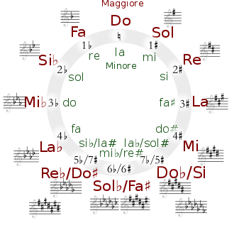
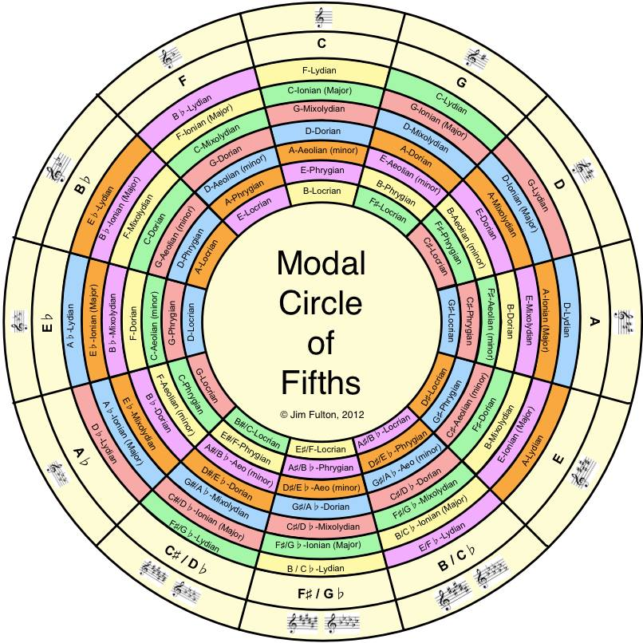
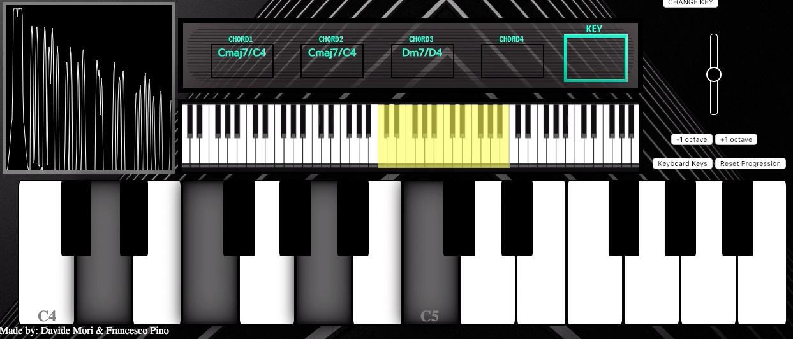

# Circle5ths-Visualizer

## 1. Behind the concept

The aim of the “Circle Visualizer” project is to provide an innovative way to visualize music, highlighting the harmonic relations in a chord progression. The studies behind harmony look into the “Circle of fifths” which represent all the notes from the chromatic scale spaced by fifth intervals: through that, it can be seen what are and how many are the chords and the alterations for each key.

***Fig.1** Circle of fifths*

Therefore, the circle of fifths is a useful tool to find the key from a chord progression. The concept behind that is to represent it as an open cylinder (Fig.2), in which on the base are located all the 12 notes from the chromatic scale spaced by fifths, and 
on the lateral surface the chords deriving from the respective major scales’ modes, related to their key. The sorting choice through which the chords are visualized rely to the study of the circle of fifths and to the “brightness” of the mode they represent: warm colors are chosen for more brightness as well as cold ones for less brightness.  

For this version it has been decided to limit the choice of the key based only on seventh chords (major, minor, dominant, semi-diminished), as they provide more information than simple triads: for example a fifth chord, derived from the mixolydian scale, can be easily recognized with its quadriad because of  its "seventh dominant" attribute; in contrast, with the triad the information of the seventh interval is lost and remains a simple major chord which could be easily misinterpreted.

           

	
***Fig.2** Modal circle of fifths*
	
## 2. Input: keyboard and MIDI management

In order to study the harmony of a chord sequence, an interface is needed to have chords as input and and so the notes. A two-octave keyboard (extendible thanks to special keys) has been chosen, which covers the octaves from C1 to C7.

It is possible to send an input in several ways: by clicking with the mouse on-screen, by pressing keys on the PC keyboard or via an external MIDI keyboard or device able to send  MIDI messages (tested with micro:bit).

Sounds generation is managed by the Web Audio APIs: they allow not only the creation of sounds through oscillators but also functions which can process, manipulate signals with a great freedom degree.
For what concern MIDI messages, they are managed by the Web MIDI APIs. They provide two basic functions:

onMIDISuccess: makes a loop around all the inputs to find any MIDI input. Once you find an incoming MIDI message, it invokes the function
getMIDImessage: assigns two values ​​of the MIDI message to two variables: midi_number for the MIDI value of the note and on_off  for the attack (144) and release (128) values.
The note frequency from the midi_number therefore is then calculated using the function:

To this point, the playNote function is called, which generates the oscillators at the determined frequency that are connected to a master volume controlled by the attack / release value.

## 3. Output: visualizations

More types of music visualization has been provided, in real time or not, to show the harmonic but also typical aspects of the audio signal as a wave.

***Fig.3** Keyboard, display and frequency spectrum*

#### 3.1 real-time visualizations

Once the inputs are sent, one can view:

the spectrum of the input signal (Fig.4): allows to display the fundamental frequency of each note with its harmonics, therefore also the spectrum of the chord played and also provides a visual feedback of the input acquisition;

Fig.4 Detail of the frequency spectrum (Dm7 chord)
Chord progression display (Fig.5): The chords on which all is based are only seventh chords; for this first version an algorithm is used to recognize the chord based on a dictionary created ad hoc ("dictionary.js") containing the name of the chord and an array of the four notes whose the chord is constituted (in the next versions it will be based on the distance of the intervals) as a key-value association.
Once the chords are recognized, the progression is temporarily saved and another algorithm is launched with the task of finding the key corresponding to the progression: the key will be displayed in the "KEY" box.

***Fig.5** Detail of display with key*
Keyboard and display commands:

Overview of the octaves (Fig.6) that the keyboard is covering in the current state (C4-C5 by default): you can raise or lower the octave by one using

***Fig.6** Octaves’ overview*

volume slider: by default the volume is set to 1 but can be adjusted from 0 (slider all the way down) up to 2 (slider all up);

: by pressing this key, users who decide to try the keyboard through the computer can display the keys corresponding to each note (Fig.6);

***Fig.7** Keyboard with matching letters*

: allows you to delete the entire visualization (read the next paragraph) and to be able to re-input a new progression.

#### 3.2 Circle of fifths’ graphic implementation 

As you can see from Fig.9 there are two main boxes:

On the left are arranged the modes of the major scales corresponding to each note: the order of the modes is chosen in such a way as to have a "brightness" scale: from a cheerful and brilliant sound (IV - Lydian) to which it is associated with a warmer color, to a more sad and gloomy one (VII - Locrian) to which a colder color is associated.
The box on the right is the graphical representation of the circle of fifths: an open cylinder where in its side surface are displayed rectangles of different color according to the corresponding mode of the played chord. It is a matrix where the columns indicate the keys and the rows indicate the modes. It is possible for a chord to belong to more than one key but by assuming different functions (hence different modes): the table can display all the chord memberships, also showing multiple rectangles simultaneously. 

From the table it is therefore possible to understand:
to which key belongs the  played chord;
for each key, what is the function (mode) of the chord;
possible chord paths between different "neighboring" tones.

     

***Fig.9** Graphic visualization of the circle of fifths.*
 
The idea behind this graphical implementation derives from a schematization of the properties of the circle of fifths, which we have collected in the matrix Tab. 1.

Once the matrix has been generated, each cell of the matrix has been mapped with a pair of values x, y in the canvas (Fig.9), equally spacing each cell. Having the name string of the chord it has been possible to implement a search algorithm within the matrix to find all the matches and create, through a “fillRect” function, the corresponding squares inside the canvas. To get the coloration, the canvas has been filled with a shade of seven colors, made visible only through the rectangles.
3.3 Chord progressions graphic implementation

***Fig.10** Graphic display of the harmonic progression*

Fig.10 represents a dynamic graphical display of the chord progression performed.
It is a useful visualization to better understand the time course of the chord sequence with reference to the modes of each played chord. To make this visualization possible, it is therefore necessary to have the key information of the sequence. From this, it is possible to assign the modes and display the progression of the chords according to the modes from which they derive, preserving the previous scale of colors, to indicate from warmer to the coldest the "brightness" level of the modes. Through this visualization it is therefore possible to visually analyze the eventual cadence of the progression, recognizing the most common ones.
The "CHANGE KEY" button is used to make a key switch, in case there would be more possible tones related to the executed sequence. In this way it will be possible to see the same sequence of chords with the new modes related to the different key.

#### 3.4 "Relative scale" graphic implementation 
 
Once the information on the musical signal, the harmony as tonality and the progression are displayed, also the information on the melody is displayed. Once the key is obtained, in fact, red bars are shown, as shown in Fig.11 in correspondence with the keys relative to the ionic scale from which the key of the progression derives, and from which also all the scales of the other modes derive, relative to the same key.

***Fig. 11** Major relative scale highlighted on keyboard (Cmaj scale above)*

# Conclusions

The “circle visualizer” is a tool that can be used with educational aims for all users who approach the world of music learning, with a new visual approach, some foundations of harmony. It is a useful tool even in the phase of composition, because it provides the tools to understand the key of a progression and suggests which scale to use to compose a melody, in addition to displaying the cadence.

# Notes

The languages used for the realization of this version of the project were mainly Javascript (with attached libraries like jQuery), HTML5 and CSS3 to manage the graphical interface;
For the management of audio and MIDI signals we have relied ourselves on the Web Audio API and Web MIDI API;
For the musical part management the tonal library available at this link has been used as a support;
For local development and communication among the different JS libraries / modules present within the project, parcel has been used as Web application bundler, in order to manage dependencies in a practical and fast way. We recommend having Node.js e Yarn installed.
